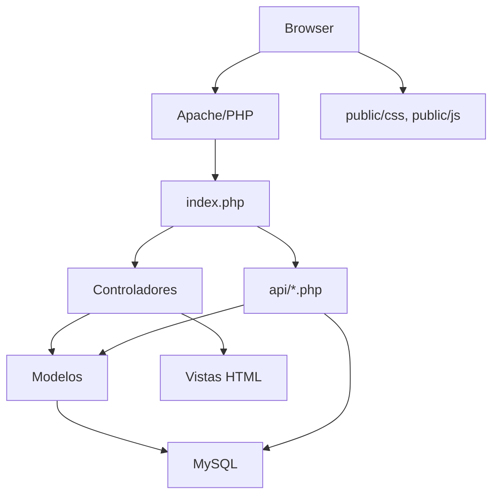
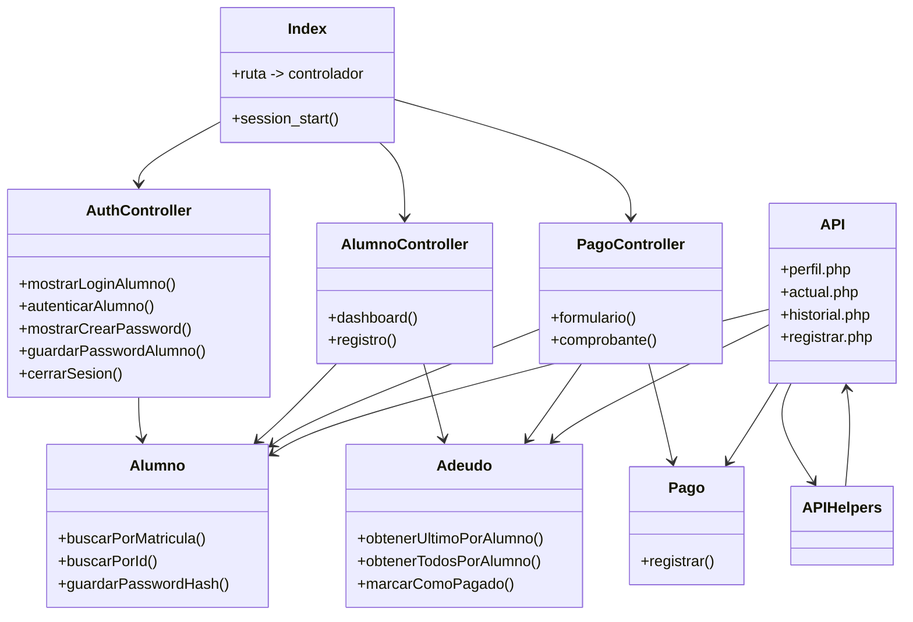
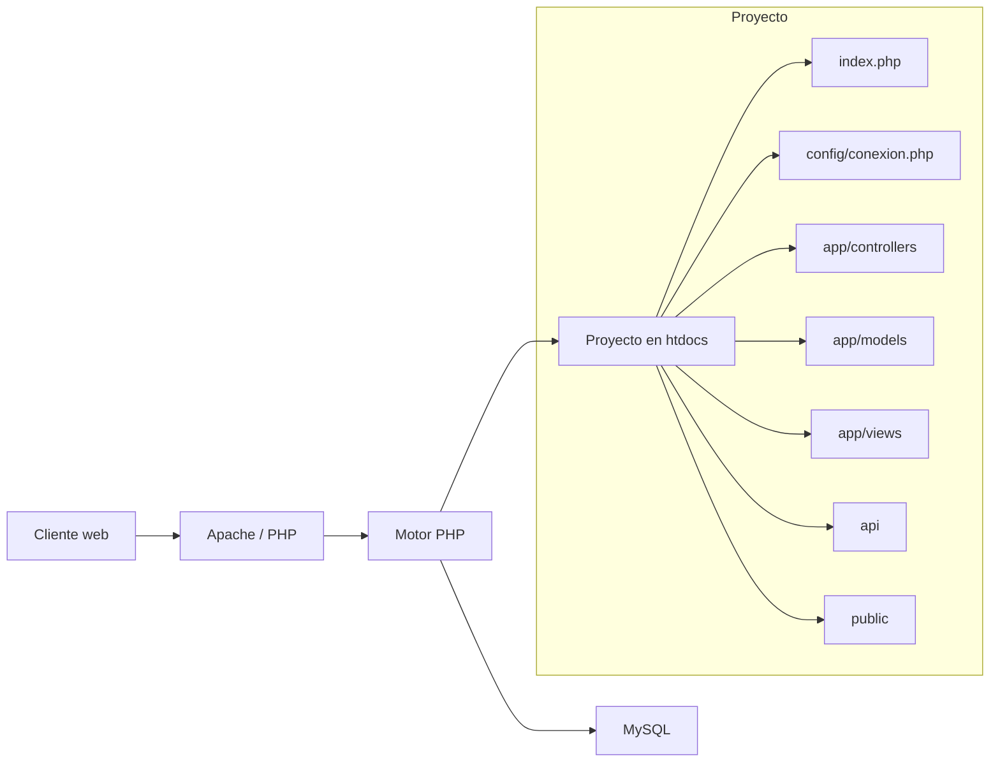

# Arquitectura del Proyecto

## Arquitectura real utilizada

El proyecto usa una arquitectura de tipo MVC aproximada con un front controller central (`index.php`) que enruta solicitudes a controladores específicos. No emplea un framework; la estructura es manual y ligera.

## Capas o módulos encontrados

- `index.php`: front controller y enrutador básico.
- `app/controllers/`: controladores de flujo para autenticación, alumno y pagos.
- `app/models/`: acceso a datos y operaciones SQL.
- `app/views/`: plantillas HTML para las diferentes pantallas.
- `config/conexion.php`: configuración y conexión a la base de datos MySQL.
- `api/`: endpoints JSON que reutilizan modelos y autenticación de sesión.
- `app/helpers/`: utilidades de formato y validaciones.

## Flujo de una petición desde la interfaz hasta MySQL

1. El navegador solicita `index.php?ruta=<nombre>`.
2. `index.php` inicia sesión con `session_start()` y evalúa `$_GET['ruta']`.
3. Se instancia el controlador correspondiente:
   - `AuthController` para `login`, `autenticar-alumno`, `crear-password`, `guardar-password`, `salir`, `login-admin`, `login-qa`.
   - `AlumnoController` para `alumno`, `registro`.
   - `PagoController` para `pago`, `comprobante`.
4. El controlador valida la sesión o los datos recibidos.
5. Si se requiere acceso a datos, el controlador usa un modelo de `app/models/`.
6. El modelo prepara y ejecuta consultas SQL en la conexión `$conn` creada en `config/conexion.php`.
7. El resultado se retorna al controlador.
8. El controlador determina la vista a cargar y pasa datos a la plantilla en `app/views/`.
9. El usuario recibe la respuesta HTML.

## Responsabilidad de cada carpeta y archivo importante

- `index.php`
  - Front controller y enrutador.
- `config/conexion.php`
  - Crea objeto `mysqli` y establece la codificación UTF-8.
- `app/controllers/AuthController.php`
  - Gestiona inicio de sesión, creación de contraseña inicial, redirecciones y cierre de sesión.
- `app/controllers/AlumnoController.php`
  - Muestra el dashboard del alumno y la página de registro demostrativo.
- `app/controllers/PagoController.php`
  - Registra pagos en transacción y presenta comprobantes.
- `app/models/Alumno.php`
  - Consulta de alumno por matrícula, correo o ID.
- `app/models/Adeudo.php`
  - Consulta del adeudo más reciente, historial y actualización de estado.
- `app/models/Pago.php`
  - Inserta registros de pago.
- `app/helpers/PeriodoHelper.php`
  - Convierte fechas de periodo en texto legible.
- `app/views/` y `public/`
  - Presentación y experiencia de usuario.
- `api/`
  - Endpoints JSON autenticados con sesión PHP.

## Uso real de MVC

- El proyecto aplica una aproximación a MVC.
- Se separan: controladores (`app/controllers/`), modelos (`app/models/`) y vistas (`app/views/`).
- Sin embargo, `index.php` centraliza la lógica de enrutamiento sin un router modular.
- No hay un nivel de servicio ni un sistema de dependencias completo.
- Conclusión: **estructura similar a MVC, pero no MVC completo con todas sus capas formales**.

## Diagrama de arquitectura (Mermaid)

## Diagrama de componentes (Mermaid)

## Diagrama de despliegue (Mermaid)

