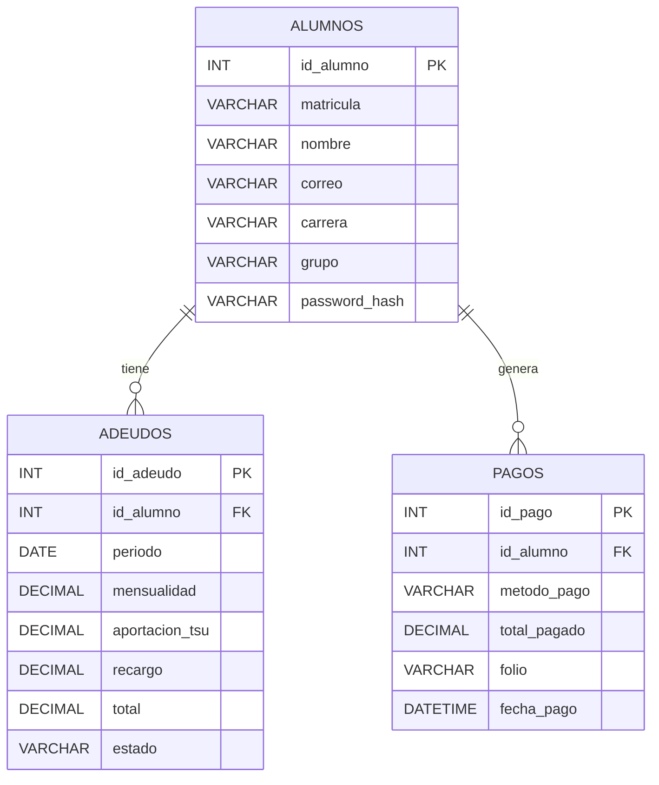

# Base de Datos

## Tablas existentes

- `alumnos`
- `adeudos`
- `pagos`

## Entidades y atributos

### `alumnos`

- `id_alumno`: INT AUTO_INCREMENT, clave primaria.
- `matricula`: VARCHAR(20), único.
- `nombre`: VARCHAR(100), no nulo.
- `correo`: VARCHAR(100), no nulo.
- `carrera`: VARCHAR(100), no nulo.
- `grupo`: VARCHAR(20), no nulo.
- `password_hash`: VARCHAR(255), nulo.

### `adeudos`

- `id_adeudo`: INT AUTO_INCREMENT, clave primaria.
- `id_alumno`: INT, clave foránea a `alumnos(id_alumno)`.
- `periodo`: DATE, nulo.
- `mensualidad`: DECIMAL(10,2), no nulo.
- `aportacion_tsu`: DECIMAL(10,2), no nulo.
- `recargo`: DECIMAL(10,2), no nulo.
- `total`: DECIMAL(10,2), no nulo.
- `estado`: VARCHAR(20), no nulo, valor por defecto `Pendiente`.

### `pagos`

- `id_pago`: INT AUTO_INCREMENT, clave primaria.
- `id_alumno`: INT, clave foránea a `alumnos(id_alumno)`.
- `metodo_pago`: VARCHAR(20), no nulo.
- `total_pagado`: DECIMAL(10,2), no nulo.
- `folio`: VARCHAR(50), no nulo, único.
- `fecha_pago`: DATETIME, no nulo.

## Claves primarias

- `alumnos.id_alumno`
- `adeudos.id_adeudo`
- `pagos.id_pago`

## Claves foráneas

- `adeudos.id_alumno` → `alumnos.id_alumno`
- `pagos.id_alumno` → `alumnos.id_alumno`

## Relaciones

- `alumnos` 1 - N `adeudos`
- `alumnos` 1 - N `pagos`

## Reglas de integridad

- La tabla `adeudos` depende de que exista el alumno en `alumnos`.
- La tabla `pagos` depende de que exista el alumno en `alumnos`.
- No existe relación directa entre `pagos` y `adeudos`.
- `adeudos.estado` se actualiza desde `app/models/Adeudo.php::marcarComoPagado()`.

## Consultas SQL importantes

- Crear base de datos y tablas:
  - `CREATE DATABASE IF NOT EXISTS portal_pagos_utsc;`
  - `CREATE TABLE IF NOT EXISTS alumnos (...)`
  - `CREATE TABLE IF NOT EXISTS adeudos (...)`
  - `CREATE TABLE IF NOT EXISTS pagos (...)`
- Consultar alumno por matrícula:
  - `SELECT id_alumno, matricula, nombre, correo, carrera, grupo, password_hash FROM alumnos WHERE matricula = ?`
- Consultar adeudo más reciente:
  - `SELECT ... FROM adeudos WHERE id_alumno = ? ORDER BY periodo DESC, id_adeudo DESC LIMIT 1`
- Insertar pago:
  - `INSERT INTO pagos (id_alumno, metodo_pago, total_pagado, folio, fecha_pago) VALUES (?, ?, ?, ?, ?)`
- Marcar adeudo como pagado:
  - `UPDATE adeudos SET estado = ? WHERE id_adeudo = ?`

## Diagrama entidad-relación (Mermaid)

## Esquema relacional

- `alumnos(id_alumno, matricula, nombre, correo, carrera, grupo, password_hash)`
- `adeudos(id_adeudo, id_alumno, periodo, mensualidad, aportacion_tsu, recargo, total, estado)`
- `pagos(id_pago, id_alumno, metodo_pago, total_pagado, folio, fecha_pago)`

## Revisión de formas normales

- Primera forma normal (1NF): sí, todos los atributos son atómicos.
- Segunda forma normal (2NF): sí, las tablas tienen clave primaria simple y los atributos no clave dependen de toda la clave primaria.
- Tercera forma normal (3NF): en general sí, aunque hay áreas de mejora.

### Problemas de normalización

- `pagos` no está ligada a `adeudos` por `id_adeudo`, por lo que la relación entre el pago y el adeudo es implícita y no está normalizada. Esto puede generar inconsistencias cuando un pago se registra sin referencia directa al adeudo relacionado.
- La tabla `alumnos` almacena `carrera` y `grupo` como texto plano en la misma tabla, lo cual está bien para esta escala, pero podría normalizarse mejor en tablas separadas si el sistema crece.
- La ausencia de restricción única en `adeudos` para `(id_alumno, periodo)` permite entradas duplicadas para el mismo periodo y alumno.

## Problemas encontrados

- `periodo` en `adeudos` es NULL por diseño en la migración condicional `database/migrations/003_asignar_periodo_julio_2026_adeudos_existentes.sql`.
- No existe índice único para evitar adeudos duplicados por periodo.
- No hay integridad referencial entre `pagos` y `adeudos`.
- El esquema no modela explícitamente un estado histórico de cambios de adeudo más allá de `estado`.
